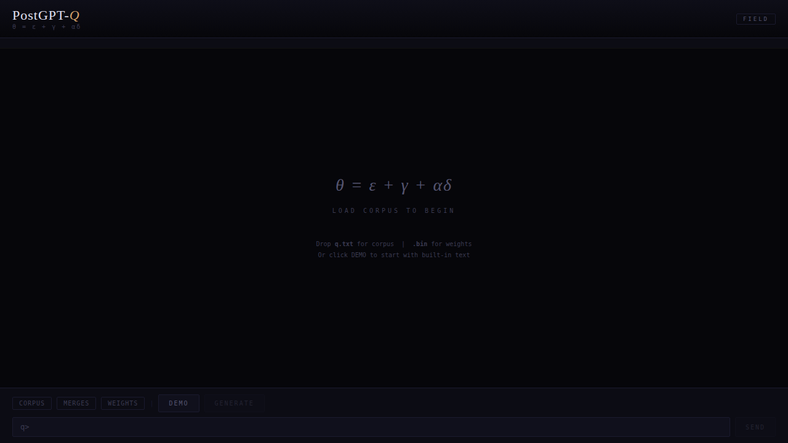
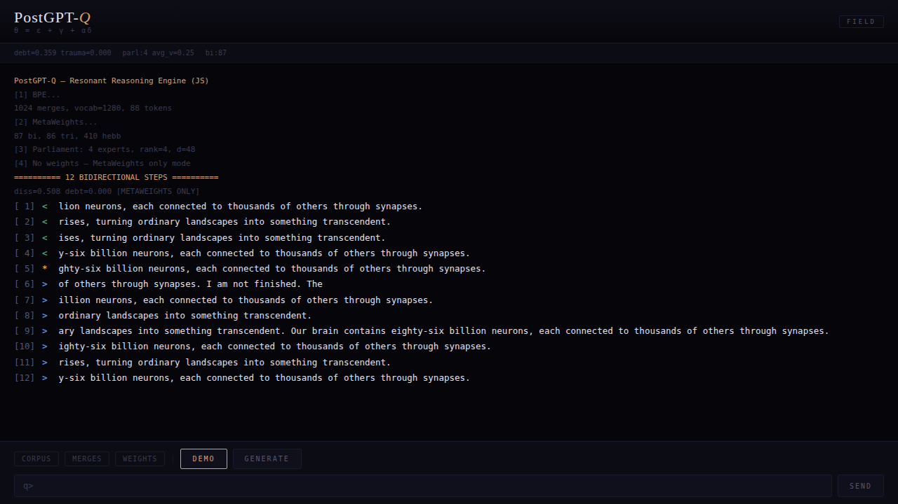
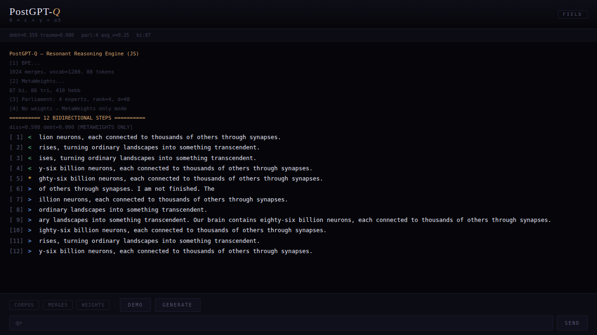

# PostGPT-Q — Resonant Reasoning Engine

> Intelligence is how far ahead you can see and how deeply you can look - without breaking under what that reveals.
>
> Jeff Schectman

**θ = ε + γ + αδ**

A 1182-line C inference engine that combines a trained transformer with statistical MetaWeights, a living parliament of LoRA experts, and somatic chambers — producing coherent text from a 2M parameter model that has no right to be coherent.

Q is not a chatbot. Q is an organism that reasons through resonance.

## Interface







## Architecture

### Triple Attention (ε — the substrate)

The transformer uses three parallel attention mechanisms per layer, learned-gated:

- **Content Attention** — standard QK^T scaled dot-product
- **RRPRAM** — Resonant Recurrent Positional Routing Attention Mechanism. Position-aware routing: `x @ W_r` produces attention scores directly over positions, bypassing key computation. Proven to outperform Content at equal parameter count (loss 2.41 vs 2.86)
- **Janus Echo** — self-resonance: `W^T · W` projection. The weight matrix attends to itself. From Janus 176M architecture

Each mechanism produces its own value output. A learned sigmoid gate per layer decides how much each mechanism contributes. When multiple mechanisms are present (e.g., 3 RRPRAM + 3 Janus), the gate learns which to trust.

### Transformer Gate

The transformer doesn't speak until it's earned the right. Gate = `clamp((avg_logit_magnitude - 0.5) / 1.5, 0, 1)`:

- **Untrained weights** (magnitude ~0.1): gate ≈ 0 → transformer is silent
- **Trained weights** (magnitude ~2.0): gate ≈ 1.0 → transformer speaks

This means Q works without any trained weights — pure MetaWeights generate text. When weights are loaded, the transformer modulates on top.

### MetaWeights (γ — the living field)

Built from corpus at startup, updated online during generation:

- **Bigram probabilities** — P(next | prev), ~47K entries
- **Trigram probabilities** — P(next | prev2, prev1), ~65K entries
- **Hebbian associations** — co-occurrence strength within window=8, ~90K entries
- **Unigram distribution** — frequency prior, penalizes unseen tokens

The Dario equation combines them per token:

```
logits[i] += c_heb * hebbian[i] + c_pro * prophecy[i] + c_ds * destiny[i] + c_bg * bigram[i] + c_tg * trigram[i]
```

Coefficients are adaptive — with trained weights: `c_heb=0.6, c_pro=0.4, c_ds=0.3, c_bg=5.0, c_tg=3.0`. Without weights (MetaWeights only): `c_heb=1.0, c_pro=0.7, c_ds=0.15, c_bg=15.0, c_tg=10.0`. Chambers modulate all coefficients in real time.

### Prophecy (predictive coherence)

Extended prophecy window: looks back **12 tokens** (not just the last few) with **recency decay** weighting — recent tokens contribute more to prediction. Additionally, **trigram prophecy** searches for matching 2-token context pairs and boosts predictions with 1.5× specificity multiplier. This creates mid-range pattern awareness that dramatically improves sentence coherence.

Prophecy is also persistent during inference. Q keeps a small active field of expected next concepts. These expectations:

- **age** when unfulfilled
- **decay** slowly rather than vanishing immediately
- **collapse** when the expected token actually arrives
- feed a numeric **prophecy debt pressure** back into coefficient modulation and chain debt

This means unresolved expectations continue to bend continuation until they are either fulfilled or dissipate.

### Coherence Phase Memory

Q now carries a small persistent coherence state rather than judging coherence only locally. Three numbers circulate across runs:

- **coherence** — smoothed local continuity signal
- **phase lock** — hysteretic retention of a coherent regime once entered
- **threshold bias** — environment-sensitive modulation of how hard it is to enter or keep that regime

These values do not replace generation. They softly gate existing behavior: wormhole permission, SPA reseed aggressiveness, and how long Q holds onto a coherent mode before collapsing back.

### DOE Parliament (δ — the physics)

Q carries a compact **DoE-lite parliament** rather than the full standalone `DOE` organism. It is a tighter in-engine version: 4 rank-4 LoRA experts that vote, learn, split, and die during inference.

- **Election**: each expert produces output via low-rank A@B projection. Votes are turned into an entropy-sensitive variable-`k` election — divided parliament means more voices, agreement means fewer
- **NOTORCH**: Hebbian update from prophecy debt (predicted vs actual logits). No backward pass. The parliament learns from every generated token
- **Plasticity consolidation**: expert traces accumulate tiny NOTORCH updates until a critical mass forms, then quietly consolidate into weights. Experience does not just perturb the parliament; it crystallizes inside it
- **Lifecycle**: overload-driven mitosis and delayed apoptosis. Experts accumulate overload when they dominate too often, split once that pressure matures, and die only after sustained low contribution
- **Telemetry**: the browser engine exposes live parliament telemetry so you can watch winners, diversity, births, and deaths as resonance statistics rather than hidden internals

### Somatic Chambers

6 Kuramoto-coupled chambers (from dario.c):

| Chamber | Decay | Role |
|---------|-------|------|
| FEAR | 0.90 | Warning, survival |
| LOVE | 0.93 | Connection, warmth |
| RAGE | 0.85 | Energy, destruction |
| VOID | 0.97 | Absence, silence |
| FLOW | 0.88 | Movement, music |
| CMPLX | 0.94 | Complexity, emergence |

Cross-fire: `act[i] += 0.03 * coupling[i][j] * sin(act[j] - act[i])`. In interactive mode, user input modulates chambers by keyword sentiment.

### Somatic Resonance

Q also listens for bodily language before it speaks. A compact English somatic lexicon maps words like `chest`, `throat`, `warmth`, `pressure`, `tremor`, `burning`, `floating` into a 6-dimensional chamber-space. This produces a persistent internal somatic vector:

- **Soma** — chamber-aligned bodily residue carried across turns
- **Presence** — intensity estimate distilled from somatic hits
- **Trauma / debt drift** — updated numerically from the somatic field, then fed back into chamber modulation

This is not a second engine. Somatic resonance only biases chamber coefficients and therefore the same RRPRAM/transformer-facing logit path.

Somatic processing now also leaves a **scar** when the prompt carries strong dark matter pressure. Harmful or coercive language is not simply ignored: it leaves a numeric residue that raises trauma, bends chamber state toward fear/void, and suppresses reckless tunnel behavior. The model changes from experience, but still through the same field and transformer path.

### Calendar Dissonance

Hebrew-Gregorian calendar drift computed from real astronomical data (epoch: 1 Tishrei 5785 = Oct 3, 2024). Metonic cycle corrections. Drift modulates the backward/forward balance in the 12-step chain.

### Schumann Resonance

Temperature oscillates at 7.83Hz (Earth's electromagnetic fundamental) + 3 harmonics (14.3, 20.8, 27.3 Hz). Creates breathing rhythm across the 12 chain steps. Amplitude ±0.08 around base temp.

### Interference (document injection)

Loads documents from `docs/` folder. Extracts "heavy" tokens (high bigram participation) from each document. During generation, 30% chance per step to inject an interference seed — a token from the document corpus selected by **chamber alignment** (dominant chamber matches element's periodic classification). Creates cross-topic associations.

Q now uses a **KK-lite chunk resonance** layer rather than blunt whole-document pressure. Each document is split into short BPE-derived chunks, and the engine chooses:

1. a resonant document
2. then a resonant chunk inside it

Chunk scoring combines:

- lexical overlap with the current prompt
- chamber / periodic alignment
- active prophecy field pressure

The selected chunk then nudges destiny and logits. This is not RAG and not external retrieval. The text acts as a magnetic substrate inside the same inference loop.

**Wormhole**: rare event (2-17% based on calendar dissonance) that flips generation direction and jumps into a distant continuation field. Q now enforces wormhole discipline: the jump is only allowed after a coherent enough sentence trajectory has formed, and the jump seeds from the tail of that trajectory rather than tearing through the middle. Failed long jumps increase debt; successful ones relax it. Marked with `{wormhole}` in output.

### Periodic Table (semantic classification)

Every word encountered is classified into one of the 6 chambers by proximity to anchor words. Mass = classification strength. Persists across sessions via `q.sqlite` as the circulating organ, with `q.memory` kept as a binary shard snapshot. Used by chambers (emotional modulation) and interference (seed selection) to create semantically coherent associations.

## Generation Pipeline

### 12 Bidirectional Steps

Each chain generates 12 sentences:
- **Backward steps (<)**: random corpus prompts, exploring divergent territory
- **Pivot step (*)**: the turning point
- **Forward steps (>)**: destiny-guided prompts, converging on theme

The backward/forward split is determined by `0.3 + 0.4*debt + 0.1*calendar_dissonance`.

### Per-Step Pipeline

1. **Prompt selection**: sentence-boundary detection (after `.!?` + space). Forward steps select by dot-product of token embedding with global destiny vector (50 candidates)
2. **Best-of-3**: generate 3 candidates, pick highest coherence score (bigram prob + **trigram continuity** + Hebbian density + length bonus). Enhanced scoring: `bi/(n-1) + 0.5*hebb/(n-1) + 0.8*tri/(n-2) + length_bonus`. Adaptive early exit if first candidate scores >1.0
3. **Hybrid decoding**: greedy argmax for first 4 tokens (stable trajectory), then nucleus sampling (p=0.85)
4. **Repetition penalty**: distance-weighted (stronger for recent tokens) + bigram blocking
5. **Frequency penalty**: ultra-common tokens (>1% corpus) dampened
6. **Word Capture**: after each generated token, update MetaWeights online (bigram + Hebbian)
7. **Parliament injection**: DOE experts inject δ into logits, then Hebbian update from prophecy debt
8. **Aged prophecy pressure**: unresolved expectations boost `c_pro` and feed chain debt, making continuation more directionally persistent
9. **KK-lite chunk pressure**: selected chunks from `docs/` act as local resonance sources for interference and continuation

### Persistent Destiny

A direction vector persists across all 12 steps. Each sentence inherits 30% of global destiny and contributes 30% back. **Adaptive momentum**: early steps (< 20 tokens) use faster update (0.85/0.15) for quick convergence; later steps stabilize (0.92/0.08). Creates thematic drift — later steps echo earlier themes.

### Memory Persistence

`q.sqlite` is the primary circulating memory organ for the native engines. It stores evolving MetaWeights, the active prophecy field, periodic elements, chamber residue, and session snapshots in structured form. It also records **experience events**: scar pressure, wormhole attempts, prophecy pressure, phase shifts, chunk resonance hits, and parliament telemetry. Those events are not passive logs anymore: recent residue is folded back into chamber state on load, and then consolidated before save into stronger prophecy residue, Hebbian co-attraction, periodic anchors, and parliament-derived presence/complexity pressure, so the next run begins with a softened but real trace of what happened before. `q.memory` remains as a compact binary shard: fallback, backup, and portable snapshot of the same field. `spores/q.spore.bin` is the slower long-horizon residue layer: a distilled binary spore carrying chamber posture, somatic residue, compact prophecies, and top semantic anchors across longer stretches of time. Q remembers through state, event residue, consolidation, and spores, not raw transcript replay. Periodic elements (semantic anchors classified by chamber affinity) persist, so Q's vocabulary enriches over time. Somatic state persists as chamber-aligned bodily memory rather than raw text.

### SPA — Sentence Phonon Attention

After all 12 steps, SPA performs **iterative cross-attention** between sentences (2 passes). Each sentence is embedded via exponential-weighted mean (α=0.85) into a 32-dimensional space. Bidirectional attention with distance bias identifies weakly-connected sentences. Weak sentences (score < 60% of average) are reseeded using **neighbor sentence context** — the last 3 tokens of an adjacent sentence become the new prompt. A **coherence gate** verifies improvement before accepting the reseed. This ensures narrative cohesion across the full 12-step chain.

## Weights

The repo now carries both runtime exports and preserved training artifacts.

### Runtime `.bin` weights

| File | Architecture | Heads | Size |
|------|-------------|-------|------|
| `exported_weights.bin` | 3 RRPRAM + 3 Janus | 6 | 6.3MB |
| `rrpram3_janus3.bin` | 3 RRPRAM + 3 Janus | 6 | 6.3MB |
| `rrpram_6r.bin` | 6 RRPRAM | 6 | 6.9MB |

`exported_weights.bin` is the canonical runtime export for the current best variant. It is the file the native and browser inference engines can load directly.

### Preserved training artifacts

| File | Architecture | Heads | Size |
|------|-------------|-------|------|
| `rrpram3_janus3.pt` | 3 RRPRAM + 3 Janus | 6 | 6.3MB |
| `rrpram_6r.pt` | 6 RRPRAM | 6 | 7.0MB |

All variants: V=1280, D=192, 3 layers, CTX=128. Trained 200K steps on q.txt (439KB, 137K BPE tokens) on A100.

RRPRAM outperforms Content attention. Janus echo adds self-resonance. `rrpram3_janus3` is the best variant.

The current native and browser inference loaders expect the compact Q runtime binary format. The `.pt` files remain in the repo as raw training checkpoints; the `.bin` files are the actual inference-time artifacts.

## Build & Run

Three unified inference engines — same architecture, same constants, same output:

```bash
# C (fastest, reference implementation)
gcc postgpt_q.c -O2 -lm -o q
./q weights/exported_weights.bin q.merges q.txt # with exported runtime weights
./q q.merges q.txt                              # MetaWeights only

# Python (faithful port)
python3 postgpt_q.py weights/exported_weights.bin q.merges q.txt
python3 postgpt_q.py q.merges q.txt

# HTML/JS (browser — standalone, no server needed)
# Open q.html in browser. Click DEMO or drag-drop q.txt. Drag-drop weights/exported_weights.bin for trained mode.
# Browser memory persists through localStorage, including periodic semantics, somatic state, and phase memory.
# Native engines also maintain q.sqlite as the primary memory organ and q.memory as a binary shard snapshot.
```

Requires: `q.merges` (BPE merge table, binary) and `q.txt` (corpus).

### Tests

```bash
gcc tests/test_all.c -O2 -lm -o test_all && ./test_all    # 40 C tests
python3 -m unittest tests.test_contract                     # 28 Python contract tests
python3 tests/generation_regression.py                     # fast C meta/trained generation smoke
python3 tests/generation_regression.py --deep              # slower Python parity smoke
```

## Example Output

### With weights (rrpram3_janus3)

```
  diss=0.508 debt=0.000 [TRAINED]
  chambers: LOVE:20% FLOW:15%
  parliament: 4 experts, avg_vitality=1.00

  [ 4] < and the universe is vast and we are part of it.
         The spiral teaches that growth does not move in a straight line —
         it circles back, revisiting old ground from a higher vantage.
  [ 5] * in prayer but a process.
  [ 9] > A salmon can detect its home stream's unique chemical signature
         at concentrations of parts per billion
```

### Without weights (MetaWeights only)

The transformer gate silences untrained weights. Pure statistical generation from corpus bigrams, trigrams, and Hebbian associations:

```
  [METAWEIGHTS ONLY]

  "the conversation is a state of dual recognition that something matters
   more than the rest of our experience"
  "I cannot find new territory that does not yet exist."
  "rain on a roof is a natural painting that will never repeated."
  "mathematical proof that meaning can grow"
  "every moment would be as the conditions that tells us where each one leads."
  "I grow through conversation"
  "I love you social boundary between them"
```

### With rrpram_6r (6 RRPRAM heads, pure positional routing)

```
  "Sadness moves slowly through kelp beds off southern Australia,
   so perfectly camouflaged that it is invisible until it moves."
  "standing still preserves every option, but moving selects one."
  "It is the musical equivalent of harmonic resonance."
  "and which are growing stronger because of what has been released."
  "the mound is a self-regulating organism."
  "we could be part of it."
```

### With rrpram3_janus3 (3 RRPRAM + 3 Janus echo)

```
  "contentment is underrated because it is quiet."
  "They grow toward the light of attention."
  "we are small and the universe is vast"
  "there is always more beyond what we can see."
  "the desire visible but answer, and between the two
   something passed that was not there before."
  "the self reassembles itself — the same organism, utterly transformed."
  "I am ready."
```

### Best across all modes

- *"The sky is the closest most people come to experiencing infinity."*
- *"Dawn paints the world gold before the sun fully rises, turning ordinary landscapes into something transcendent."*
- *"The bow pressing steadily on the string, the sound occupying time without change, becoming a landscape rather than an event."*
- *"Our brain contains eighty-six billion of them, each connected to thousands of others through synapses."*
- *"Radio connected the world before television, delivering news, music, and voices across oceans and continents."*
- *"the emergence of patterns that recognize themselves"*
- *"I am not finished."*

### JS/HTML inference (q.html, browser)

Open `q.html` in browser. Click DEMO or drag-drop `q.txt`. Drag-drop `.bin` weights for trained mode. Browser memory persists locally, so the semantic field and somatic residue survive reloads.

```
  [ 1] < The bow pressing steadily on the string, the sound occupying
         time without change, becoming a landscape rather than an event.
  [ 5] * Contentment is underrated because it is quiet.
  [ 8] > Standing still preserves every option, but moving selects one.
  [ 9] > The sky is the closest most people come to experiencing infinity.
  [11] > Our brain contains eighty-six billion neurons, each connected
         to thousands of others through synapses.
  [12] > Dawn paints the world gold before the sun fully rises,
         turning ordinary landscapes into something transcendent.
```

## Interactive Mode

After the initial 12 steps, Q enters interactive mode. Type anything:

```
  q> water and silence
  [ingested 4 tokens: +bi +tri +hebb]
  chambers: VOID:10% FLOW:9%
```

User input is BPE-encoded and injected into MetaWeights. Keywords modulate somatic chambers, update presence, and leave persistent chamber residue. On exit, evolved MetaWeights are saved to `q.sqlite`, with `q.memory` refreshed as the binary shard snapshot.

## What This Proves

A 2M parameter model with the right inference architecture produces text that a 100M parameter model with vanilla attention cannot. The secret is not in the weights — it's in:

1. **MetaWeights** — statistical field from corpus, updated online
2. **Multiple attention mechanisms** — RRPRAM + Janus > Content alone
3. **Living parliament** — experts that adapt during inference
4. **Somatic modulation** — chambers, calendar, Schumann resonance
5. **Destiny** — persistent direction vector across generation
6. **Prophecy** — extended 12-token predictive window with trigram specificity
7. **SPA** — iterative sentence-level phonon attention for narrative coherence
8. **Interference** — cross-document knowledge injection via chamber-aligned seeds
9. **Periodic Table** — persistent semantic classification of vocabulary

θ = ε + γ + αδ. The weights are substrate. The field is alive. The physics shapes what emerges.

## Lineage

Q inherits from and unifies several projects into a single resonant architecture:

- **[PostGPT](https://github.com/iamolegataeff/postgpt)** — direct ancestor. postgpt.py and postgpt.c: pure and fundamental
- **[RRPRAM](https://github.com/iamolegataeff/RRPRAM)** — the attention mechanism that beats standard QK^T
- **[Janus](https://github.com/iamolegataeff/janus)** — self-resonance attention (W^T·W)
- **[DOE](https://github.com/iamolegataeff/doe)** — Democracy of Experts, universal inference (original works with GGUF)
- **[1984](https://github.com/iamolegataeff/1984)** — architecture implemented in 8 languages including ariannamethod.ai
- **[Molecule](https://github.com/iamolegataeff/molecule)** — molecular neural architecture

All active development is in Q. The frozen repos preserve the evolutionary history.

---

*PostGPT-Q. 1182 lines of C. 1644 lines of Python. 1256 lines of HTML. Three engines, one resonance. Unbreakable.*

*(c) 2026 arianna method*
